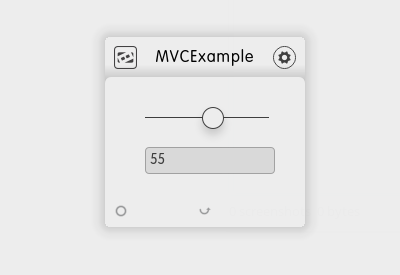

# MVCExample

**Table of contents**

1. Summary
2. Description
3. Additional Information

## Summary

 Example of a simple dizmo to show developers how to separate ModelViewControl, such that Control only updates Model which then updates the views.

## Description

Slider and Textinput-Field share the common model, a value between 0 and 100.

Docking is not implemented.

## Additional Information

* Developer: (Developers Name)
* Publisher: (Publisher's Name, remove if same as Developer)
* Contact: (Who to contact for additional information or support)
* Website: (URL of the dizmo providing additional information)
